# AI Workflow Playbook

> Scope: This version is tailored to the Itineris delivery workflow. Phase 1 is detailed, and the downstream feature-delivery loop is documented at a workflow level.

## 1. Executive Summary

This playbook describes how we take the Itineris project from document-only inputs to a working delivery pipeline that produces implementation-ready specifications, production code, and automated tests.

It shows how DockOck, OpenSpec, OpenCode, and the supporting agent workflows come together in the Itineris delivery process, so the document reads as a practical guide for this engagement rather than a generic internal note.

The end state is a repeatable pipeline that produces:

- production code
- unit tests
- integration tests
- performance tests
- UI tests
- traceable links back to source documentation

The front door into that system is DockOck: it transforms Itineris Word requirements into Gherkin features while using Excel and Visio material as semantic reference context. Those generated Gherkins are then compared against manually written Itineris validation Gherkins, improved through pattern extraction, and only then promoted as the hand-off artifact for implementation planning, feature delivery, independent automated tests, and Playwright UI tests.

This document uses portable text diagrams rather than Mermaid blocks so it renders correctly in any Markdown viewer without extra plugins.

## Table of Contents

1. [Executive Summary](#1-executive-summary)
2. [How to Use This Document](#2-how-to-use-this-document)
3. [End-State Workflow](#3-end-state-workflow)
4. [Core Principles](#4-core-principles)
5. [Terminology Standard](#5-terminology-standard)
6. [Phase Map](#6-phase-map)
7. [Documentation to Gherkin Workflow](#7-documentation-to-gherkin-workflow)
8. [Documentation to Markdown Knowledge Base](#8-documentation-to-markdown-knowledge-base)
9. [Documentation to Dependency Graph](#9-documentation-to-dependency-graph)
10. [Documentation to Index-Only Retrieval Base](#10-documentation-to-index-only-retrieval-base)
11. [Screenshots](#11-screenshots)
12. [How These Outputs Feed the Delivery Workflow](#12-how-these-outputs-feed-the-delivery-workflow)
13. [Itineris Validation, Implementation, and Test Strategy](#13-itineris-validation-implementation-and-test-strategy)
14. [OpenSpec to OpenCode Delivery Loop](#14-openspec-to-opencode-delivery-loop)

## 2. How to Use This Document

Use this sequence for the fastest path through the document.

### Audience Launcher

Use this launcher when you want the document to route the reader to the right entry point immediately.

| Reader | Start Here | Why |
|---|---|---|
| Executive or client stakeholder | [AI_EXECUTIVE_SUMMARY_VISUALS.html](AI_EXECUTIVE_SUMMARY_VISUALS.html) | fastest presentation-first overview of the full Itineris workflow |
| Product, QA, or business reviewer | [AI_WORKFLOW_VISUALS.html](AI_WORKFLOW_VISUALS.html) | best visual explanation of document intake, validation, and test generation |
| Architecture or delivery lead | [AI_AGENT_ROUTING_VISUALS.html](AI_AGENT_ROUTING_VISUALS.html) | shows ownership model, specialist routing, and repair vs maintenance choices |
| Engineering lead or implementation reviewer | [AI_DELIVERY_LOOP_VISUALS.html](AI_DELIVERY_LOOP_VISUALS.html) | shows how approved artifacts move through OpenSpec, OpenCode, review, and repair |
| Deep document reader | [AI_WORKFLOW_PLAYBOOK.md](AI_WORKFLOW_PLAYBOOK.md) | full narrative, rationale, runbooks, and detailed workflow sections |

1. Read the phase overview in the [Phase Map](#6-phase-map) to understand where the current work sits in the end-to-end lifecycle.
2. If you want the Itineris-specific execution story, start with the [Itineris Validation, Implementation, and Test Strategy](#13-itineris-validation-implementation-and-test-strategy).
3. If you are moving from approved artifacts into implementation, start with the [OpenSpec to OpenCode Delivery Loop](#14-openspec-to-opencode-delivery-loop).
4. Use the [Current Custom Agent and Command Catalog](#current-custom-agent-and-command-catalog) only when you need to know what a specific agent or command does.
5. Use the [Delivery Stage Selection Matrix](#delivery-stage-selection-matrix) and the [Agent Combination Runbook](#agent-combination-runbook) when you need to choose the execution stack for a delivery stage.
6. Use the [Example Feature Flows](#example-feature-flows) when the current work looks mostly backend-dominant, frontend-dominant, or infrastructure-dominant.
7. Use the [Quick Routing Cheat Sheet](#quick-routing-cheat-sheet) and the [Visual Routing Diagram](#visual-routing-diagram) when you only need a fast routing decision.
8. Use the [Visual Delivery Loop Diagram](#visual-delivery-loop-diagram) when you need to explain how planning, implementation, review, repair, and maintenance relate.

### Visual Workflow Maps

For a faster first read, start with the visuals before the detailed prose.

Open the interactive companions here:

- [AI_EXECUTIVE_SUMMARY_VISUALS.html](AI_EXECUTIVE_SUMMARY_VISUALS.html)
- [AI_WORKFLOW_VISUALS.html](AI_WORKFLOW_VISUALS.html)
- [AI_AGENT_ROUTING_VISUALS.html](AI_AGENT_ROUTING_VISUALS.html)
- [AI_DELIVERY_LOOP_VISUALS.html](AI_DELIVERY_LOOP_VISUALS.html)

#### Workflow Overview

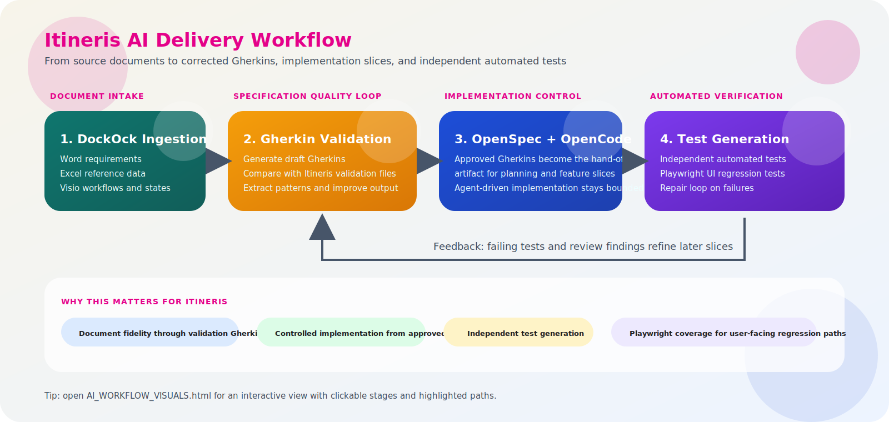

#### Validation and Test Feedback Loop

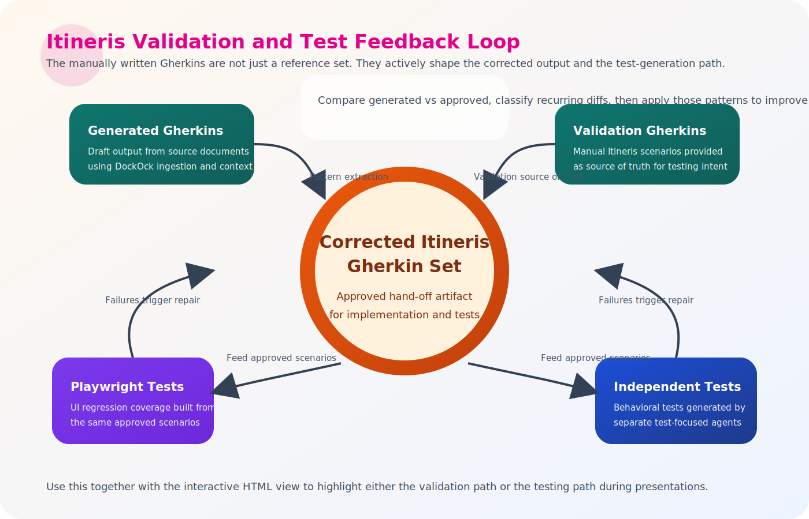

#### Agent Routing

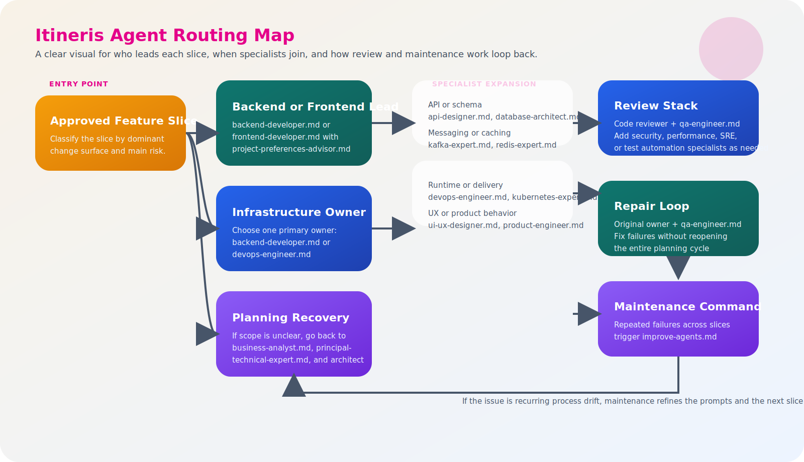

#### OpenSpec to OpenCode Delivery Loop

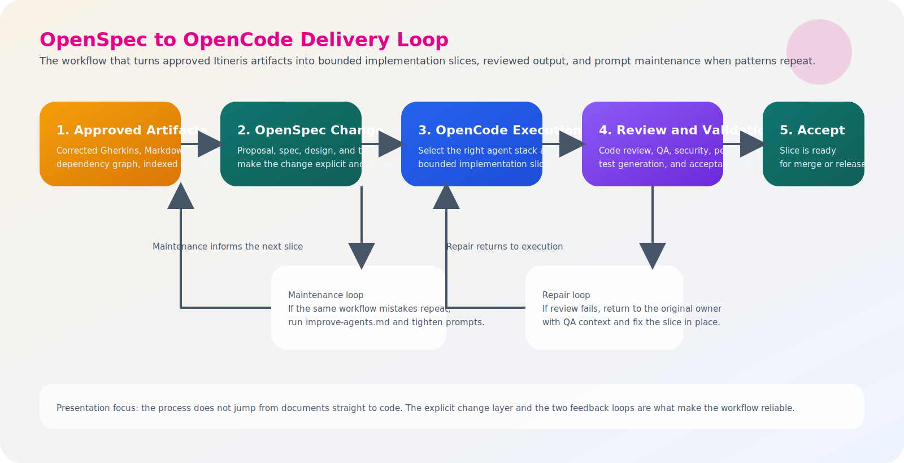

## 3. End-State Workflow

The complete workflow is intended to progress through these phases:

1. Documentation intake and normalization
2. Artifact generation and retrieval indexing from documentation
3. Architecture and implementation planning
4. Code generation and iterative refinement
5. Unit test generation and enforcement
6. Integration test generation, including Testcontainers-based environment tests
7. Performance test generation and budget validation
8. UI test generation and user-flow verification
9. Human review, defect fixing, and release hardening

At this stage, the playbook documents four output and retrieval paths built on the same ingestion pipeline:

- documentation to Gherkin executable specifications
- documentation to Markdown knowledge-base documents
- documentation to dependency graphs
- documentation to an index-only retrieval base for chat and MCP consumers

## 4. Core Principles

- Documentation is the initial source of truth.
- For Itineris, approved Gherkin becomes the operational source of truth for implementation and automated testing.
- AI agents should operate on normalized, structured context instead of raw, disconnected files.
- Requirements documents are primary inputs.
- Spreadsheets and diagrams are supporting evidence unless explicitly promoted to primary inputs.
- Every downstream artifact should be traceable back to the originating documentation.
- Generated artifacts should pass through explicit quality gates before they become source-of-truth inputs for the next phase.

## 5. Terminology Standard

The playbook uses the following terms deliberately. They should be read consistently throughout the document.

- Phase: a top-level lifecycle segment in the end-to-end workflow, such as documentation intake, artifact generation, implementation planning, code generation, or hardening.
- Delivery stage: a step inside the OpenSpec-to-OpenCode execution loop, specifically planning, implementation, review, repair, or maintenance.
- Feature slice: a bounded, reviewable unit of implementation work that maps back to one or more OpenSpec tasks.
- Dominant slice type: the change surface that should determine the primary implementation owner for a feature slice, typically backend-dominant, frontend-dominant, or infrastructure-dominant.
- Planning defect: a blocker caused by unclear scope, missing acceptance criteria, or unresolved technical boundaries.
- Repair defect: a blocker caused by incorrect implementation, failing tests, build issues, deployment issues, or unstable runtime behavior after the scope is already acceptable.

Usage rule:

- use `phase` for the macro lifecycle
- use `delivery stage` for the OpenSpec-to-OpenCode loop
- use `feature slice` for the bounded unit of execution and review

## 6. Phase Map

### Phase 1. Documentation Intake and Normalization

Goal: load heterogeneous project documentation into a machine-usable representation.

Inputs:

- Word documents for requirements and narrative specifications
- Excel workbooks for field definitions, reference tables, status matrices, enumerations, or environment data
- Visio diagrams for workflows, architectures, state transitions, and interaction diagrams

Outputs:

- parsed document content
- extracted tables and diagram text
- optional image descriptions
- normalized project context for agent consumption

### Phase 2. Artifact Generation and Retrieval Indexing

Goal: convert normalized documentation into durable artifacts and retrieval indexes that can drive later coding and testing workflows.

This is the most detailed section in the current version of the playbook.

### Phase 3. Architecture and Implementation Planning

Goal: turn approved executable specifications into architecture, slice definitions, delivery order, and coding prompts.

Planned outputs:

- bounded feature slices
- target architecture
- implementation backlog
- dependency graph
- OpenSpec change artifacts such as proposal, spec, design, and tasks
- OpenCode-ready execution packets
- coding agent work packets

### Phase 4. Code and Test Generation

Goal: generate production code and test suites from approved specifications and plans.

Planned outputs:

- application code
- iterative code changes driven by OpenSpec and OpenCode commands
- unit tests
- integration tests
- performance tests
- UI tests

### Phase 5. Verification and Hardening

Goal: prove the generated system works under functional, integration, performance, and UI constraints.

Planned outputs:

- green test suites
- performance measurements
- reviewed diffs
- release candidate

## 7. Documentation to Gherkin Workflow

This workflow is for projects where the initial usable assets are documentation files rather than source code.

### Objective

Produce high-quality Itineris Gherkin features from requirements documents while using related Excel and Visio files as semantic reference context rather than independent feature generators.

### Why This Matters

In real projects, the narrative requirements often live in Word documents, while critical details are spread across:

- Excel sheets containing field lists, statuses, valid values, mapping tables, or configuration data
- Visio diagrams containing state machines, workflows, system interactions, or architecture relationships

If the AI agent only sees the Word document, the generated scenarios are usually incomplete. The supporting files provide the missing domain constraints. The workflow therefore treats Word as the primary specification source and uses Excel and Visio as RAG-backed context providers.

### Inputs and Roles

| File Type | Role | Expected Use |
|---|---|---|
| `.docx` | Primary | Generate Gherkin features from requirement narratives |
| `.xlsx`, `.xls`, `.ods` | Context | Supply reference data, enumerations, and structural detail |
| `.vsdx` | Context | Supply workflows, state transitions, and system relationships |

### Operator Workflow in DockOck

1. Open DockOck.
2. Select the output directory if generated artifacts should be saved.
3. Add primary Word documents to the Source set.
4. Add supporting Excel and Visio files as related project inputs.
5. Allow auto-grouping by name or manually organize related files if needed.
6. Choose the provider, model, and pipeline mode.
7. Generate Gherkin.
8. Review the per-document or per-group output.
9. Save the generated feature files.
10. Optionally export the result to OpenSpec for downstream planning artifacts.

### What the System Does Internally

#### Step 1. Parse and Normalize All Files

Each file is parsed into text that the agent can consume.

- Word files are read as structured document content.
- Excel files are read as worksheet and row data.
- Visio files are read as page, shape, label, connector, and diagram text data.

The result is a normalized project context built from heterogeneous documentation.

#### Step 2. Assign Primary vs Context Roles

The workflow distinguishes between files that should produce Gherkin and files that should only enrich the prompt.

- Word documents are primary inputs.
- Excel and Visio files are context-only inputs.

This matters because reference tables and diagrams often contain domain rules but do not represent end-user behavior in a form that should be converted directly into scenarios.

#### Step 3. Build Shared Project Context

The system accumulates parsed content across all loaded files.

This shared context is used to:

- preserve cross-document terminology
- build a project glossary
- expose related entities, actors, systems, and data objects
- provide context when a requirement references concepts defined elsewhere

#### Step 4. Build Retrieval Context with Semantic Search

Supporting Excel and Visio content is made available through semantic retrieval.

For each Word-to-Gherkin transformation, the system can retrieve the most relevant supporting chunks from other loaded documents, rather than injecting every file in full.

This is the key behavior for the workflow you described:

- the Word document drives the scenario generation
- the Excel and Visio files supply precise supplemental information
- semantic retrieval determines which supporting content is relevant for the current transformation

Examples:

- a Word requirement mentions a status transition, and retrieval pulls the matching Visio state flow
- a Word requirement mentions an asset type or field, and retrieval pulls the relevant Excel row or worksheet section
- a Word requirement describes a business flow, and retrieval pulls related diagram connectors or configuration values

#### Step 5. Run the LLM Pipeline

The active pipeline mode controls how much processing happens per work item.

| Mode | Intent |
|---|---|
| Fast | lower latency, typically a direct generation path |
| Standard | balanced quality and cost with more structure |
| Full | extraction, generation, and review passes for highest quality |

The current DockOck architecture supports a multi-step pipeline centered on:

1. extraction
2. generation
3. review

This pipeline is appropriate because documentation is often inconsistent, repetitive, or ambiguous. The extraction pass creates structured understanding, the generation pass emits Gherkin, and the review pass tightens syntax and coverage.

#### Step 6. Persist and Reuse Knowledge

The system can cache parsing and model results and also retain retrievable project memory, which reduces redundant work across repeated runs and helps later processing stay consistent.

#### Step 7. Review and Save the Result

The user reviews the generated feature text, optionally compares it with a golden version, and saves the output for downstream use.

### Output of This Phase

The output of this workflow is a set of Gherkin feature files that represent executable specifications derived from the project documentation.

These features become the starting point for later phases such as:

- architecture derivation
- implementation planning
- unit test generation
- integration test generation
- performance scenario definition
- UI flow validation

## 8. Documentation to Markdown Knowledge Base

This workflow uses the same document-ingestion and semantic-context pattern as the Gherkin path, but the output is a structured Markdown knowledge base rather than executable scenarios.

### Objective

Produce a reusable Markdown knowledge base from project documentation so downstream agents have a richer narrative and structural reference document in addition to, or instead of, Gherkin.

### When to Use Markdown Output

Markdown mode is useful when the target artifact should preserve broader explanatory context such as:

- architecture descriptions
- business and domain overviews
- glossary and terminology
- reference tables
- workflows and diagram summaries
- implementation context for coding agents

Where Gherkin is optimized for executable behavior, Markdown is optimized for durable project knowledge.

### Input Pattern

The input pattern is the same as the Gherkin flow:

- Word documents provide the primary narrative
- Excel contributes structured reference data
- Visio contributes workflow, architecture, or state information
- semantic retrieval pulls the most relevant supporting fragments into generation

### Operator Workflow in DockOck

1. Load the same project documentation set used for Gherkin generation.
2. Set the Output mode to Markdown (.md).
3. Choose provider, model, and pipeline mode.
4. Start generation.
5. Review the generated Markdown knowledge-base output.
6. Save individual Markdown files or the full generated set.
7. Optionally use the result as high-context input for downstream coding agents.

### What the System Produces

The Markdown path is designed to generate richer knowledge artifacts, including:

- executive summaries
- architectural descriptions
- domain entities and glossary material
- reference tables from spreadsheets
- diagram interpretations from Visio or image-derived content
- consolidated project indexes across generated documents

### Relationship Between Gherkin and Markdown Outputs

These two outputs are complementary, not competing:

- Gherkin captures the behavioral contract
- Markdown captures the broader knowledge context

In practice, a mature AI delivery workflow can use both:

1. Markdown provides architectural and domain grounding.
2. Gherkin provides executable acceptance criteria.
3. Coding agents use both artifacts together to produce more accurate implementations and tests.

## 9. Documentation to Dependency Graph

This workflow uses the same document-ingestion pipeline, but instead of generating scenarios or narrative knowledge articles, it extracts business entities, rules, transitions, and relationships into a dependency graph.

### Objective

Produce a machine- and human-readable dependency graph showing how business cases, entities, services, actors, rules, and lifecycle transitions relate across the documentation set.

### When to Use Dependency Graph Output

Dependency graph mode is useful when the team needs to understand:

- business-case relationships
- entity dependencies
- process triggers and downstream effects
- lifecycle states and transitions
- cross-document structural links
- architecture and implementation impact before coding starts

Where Gherkin expresses behavior and Markdown expresses knowledge, the dependency graph expresses structure and linkage.

### Input Pattern

The input pattern is still the same:

- Word documents provide the main business-case and requirement descriptions
- Excel contributes reference data, business-rule detail, and entity attributes
- Visio contributes flows, transitions, and system relationships
- semantic retrieval helps connect the relevant supporting context during graph generation

### Operator Workflow in DockOck

1. Load the documentation set.
2. Set the Output mode to Dependency Graph.
3. Start generation.
4. Review the generated graph summary inside DockOck.
5. Copy the JSON, Mermaid, or DOT representations if needed.
6. Open the visual browser view to inspect the rendered graph.
7. Save or reuse the result as a planning artifact for downstream design and coding work.

### What the System Produces

The dependency-graph path is designed to surface:

- entities such as actors, systems, services, data objects, and processes
- directed dependencies between those entities
- business rules attached to the relevant nodes
- lifecycle states and transitions where the documentation describes them
- a combined multi-source graph across the imported documentation set
- Mermaid-compatible graph data for visualization

### Why This Matters for AI Delivery

This output is useful before code generation because it exposes coupling and dependency structure that may not be obvious from raw documents.

That helps later phases answer questions such as:

- which business cases depend on the same shared services or data objects
- which upstream entities trigger downstream processing
- which validations or states constrain implementation design
- where test boundaries should be drawn for unit and integration tests

### Browser Visualization Step

Unlike the plain text outputs, the dependency graph can also be opened in a rendered browser view. That gives the team a fast way to inspect the Mermaid diagram visually, zoom it, and export it for discussion or review.

### Relationship to the Other Output Modes

The three output modes complement each other:

- Gherkin defines behavior
- Markdown captures domain and architecture context
- Dependency graph reveals structural and causal relationships

Together, they provide a stronger input package for downstream coding and test-generation agents.

## 10. Documentation to Index-Only Retrieval Base

This workflow uses the same parsing and normalization pipeline, but instead of generating a new visible artifact in the main output panel, it builds a persistent retrieval layer for downstream question answering.

### Objective

Take loaded project documents, vectorize their parsed content, and store the results in Mongo Atlas so the DockOck Chat UI and MCP server can serve semantic search and full-document retrieval to coding models.

### When to Use Index-Only Mode

Index-only mode is useful when the team wants to:

- ingest project documents without generating Gherkin or Markdown immediately
- build a searchable semantic knowledge base first
- let coding models query source material through chat or MCP tools
- persist parsed source content and any previously generated artifacts for later reuse
- separate document indexing from later generation workflows

Where Gherkin produces executable specifications, Markdown produces narrative knowledge, and dependency graph produces structural linkage, index-only mode produces retrieval infrastructure.

### Operator Workflow in DockOck

1. Load the source document set into DockOck.
2. Set the Output mode to IndexOnly.
3. Confirm Mongo Atlas connectivity and embedding configuration.
4. Start indexing.
5. Wait for parsing, chunking, embedding, and Mongo upsert operations to complete.
6. Open the Chat UI to query the indexed knowledge base semantically.
7. Optionally enable or connect to the MCP server so external coding agents can query the same indexed corpus.

### What the System Does Internally

#### Step 1. Parse and Normalize the Source Files

The same ingestion pipeline used by the generation modes extracts machine-usable text from Word, Excel, and Visio inputs.

- Word files contribute structured requirement and narrative text.
- Excel files contribute worksheet content, tables, enumerations, and reference values.
- Visio files contribute page labels, shapes, connectors, and workflow text.

#### Step 2. Persist Full Source Documents

The parsed source text is stored as full documents in MongoDB so downstream consumers can retrieve complete source material when they already know the filename they need.

This supports exact retrieval in addition to semantic search.

#### Step 3. Chunk and Vectorize Parsed Content

The normalized text is split into retrievable chunks, embedded with the configured embedding provider, and prepared for vector search.

This creates the semantic representation needed for natural-language querying rather than filename-only lookup.

#### Step 4. Store Vectors in Mongo Atlas

Embedded chunks are upserted into the Mongo Atlas vector-backed collections used by DockOck's RAG layer.

This gives the system a persistent cross-session retrieval base instead of a transient in-memory index.

#### Step 5. Expose the Indexed Corpus to Chat and MCP

Once indexing completes, the same stored content can be queried from two fronts:

- the built-in Chat UI for interactive question answering inside DockOck
- the MCP server for external coding models and agent clients

In both cases, the query path retrieves semantically relevant chunks from Mongo Atlas and can also fall back to full-document retrieval when the caller needs the complete stored source or previously generated artifact.

### What the System Produces

Index-only mode produces a persistent retrieval substrate rather than a new authored document.

That includes:

- vectorized document chunks stored for semantic search
- full parsed source documents stored for direct retrieval
- any previously generated Markdown or Gherkin session artifacts made available for full-document lookup
- a reusable project knowledge base for the chat panel and MCP tools

### Why This Matters for Coding Models

Coding models are more effective when they can query a stable project knowledge base instead of relying only on a single prompt window.

Index-only mode enables that by letting models:

- ask semantic questions across the indexed documentation set
- retrieve the most relevant chunks without loading every document into context
- fetch full documents when a precise source file is required
- reuse the same indexed corpus across UI sessions and external agent runs

This makes the indexed documentation set available as an operational context service for implementation, debugging, and planning workflows.

### Quality Gates for Documentation-Derived Specifications

Before a generated feature is promoted downstream, it should satisfy the following checks:

1. It reflects the behavior described in the primary Word document.
2. It incorporates relevant constraints from Excel and Visio context.
3. It uses domain terminology consistently.
4. It is valid Gherkin syntax.
5. It covers happy path, negative path, and validation behavior when those are present in the documentation.
6. It does not invent unsupported business rules.
7. The feature can be traced back to specific source documents.

## 11. Screenshots

The screenshots in this section illustrate the operator flow through DockOck using the image assets currently available in the repository.

### Screenshot C. Generated Gherkin Output

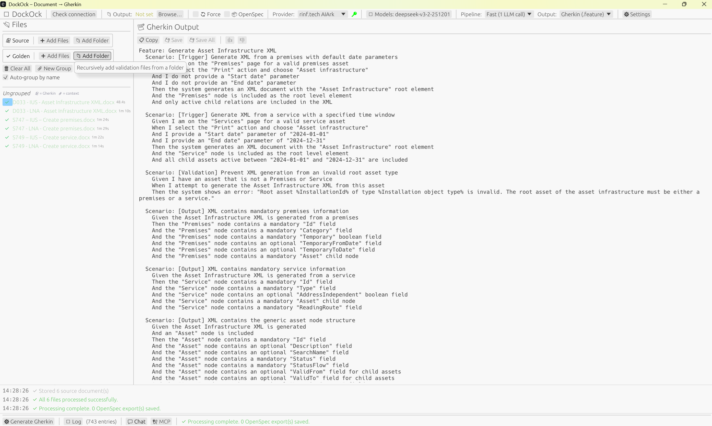

Completed generation state in DockOck. The run has finished successfully, the Gherkin output is visible, and processed source documents are marked complete in the file list.

What it shows:

- generated Gherkin displayed in the right panel
- successful processing state in the left-hand file list
- OpenSpec export enabled in the run configuration
- saved or export-ready results after generation completes

Suggested caption:

"Generated executable specification after processing completes. The output Gherkin is reviewed, saved, and can be sent downstream to OpenSpec or later coding agents."

### Screenshot D. Markdown Knowledge-Base Generation In Progress

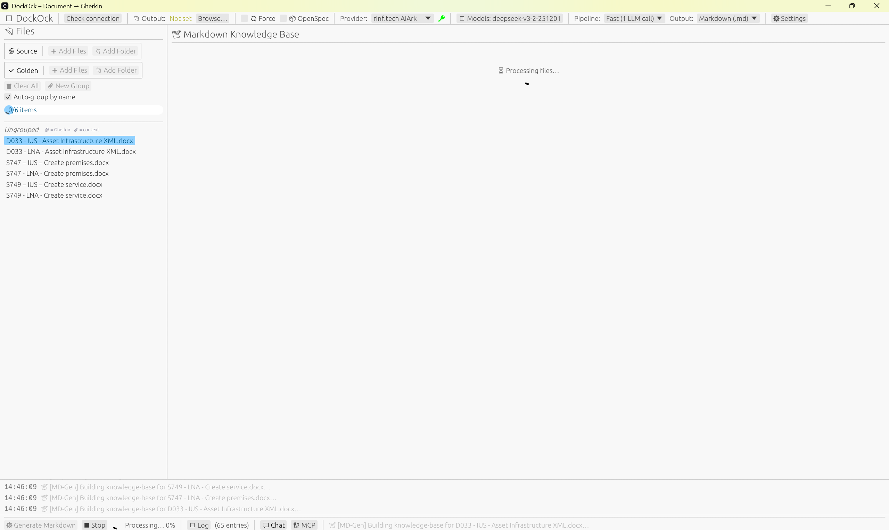

DockOck running in Markdown output mode. The same source document set is being processed through the pipeline, but the target artifact is a Markdown knowledge base instead of a Gherkin feature file.

What it shows:

- Output mode switched to Markdown (.md)
- the right panel labeled Markdown Knowledge Base
- the same project files loaded on the left side
- active processing in progress for markdown generation
- markdown generation exposed as a first-class workflow, not a separate tool

Suggested caption:

"Markdown knowledge-base generation uses the same documentation-ingestion workflow as Gherkin, but produces reusable narrative project context for downstream AI agents."

### Screenshot E. Markdown Knowledge-Base Generation Complete

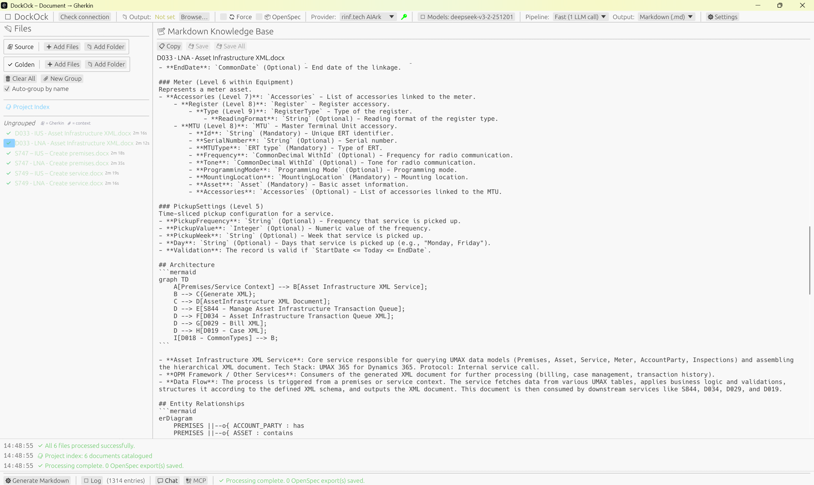

Completed markdown generation in DockOck. The right panel now shows the generated Markdown knowledge base, the left panel shows processed documents and the project index, and the status area confirms successful completion.

What it shows:

- markdown output rendered after processing finishes
- a generated project index in the file list
- successful completion messages in the bottom log area
- processed source documents marked complete
- the Markdown output mode operating as a durable knowledge-base generator

Suggested caption:

"Completed markdown knowledge-base generation. The resulting document set can be saved and reused as high-context project input for downstream architecture, coding, and testing agents."

### Screenshot F. Dependency Graph Before Rendering

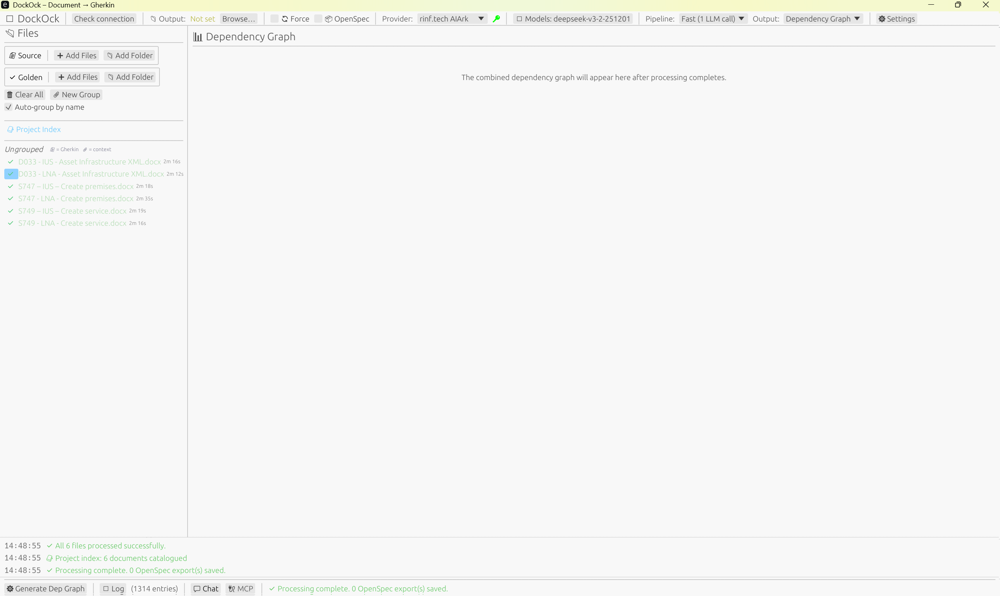

DockOck in Dependency Graph mode before the combined graph is rendered. The output panel is prepared to show the merged graph result after processing completes.

What it shows:

- Output mode switched to Dependency Graph
- the right panel labeled Dependency Graph
- the imported project files on the left
- the pre-render state before the combined dependency graph appears

Suggested caption:

"Dependency graph mode uses the same document-ingestion workflow but targets structural business relationships instead of scenarios or narrative documentation."

### Screenshot G. Dependency Graph Generated in DockOck

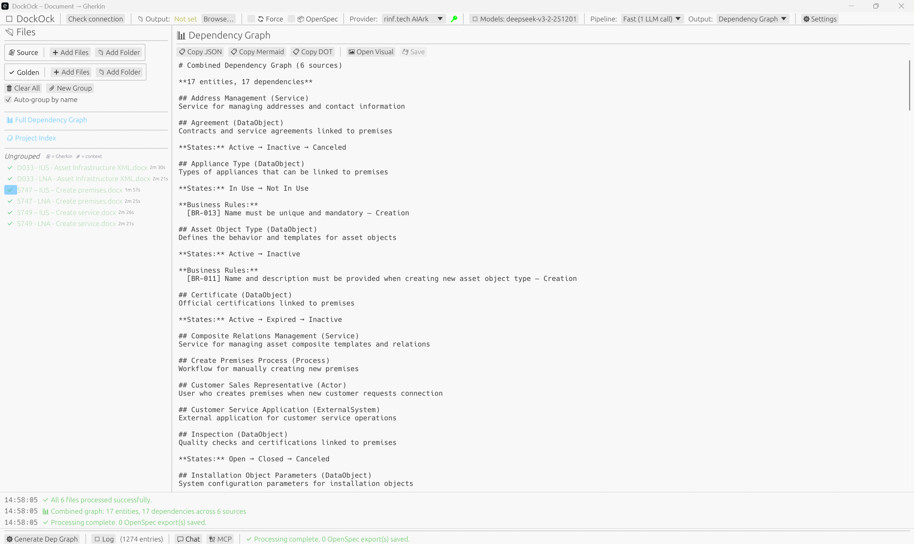

Completed dependency-graph generation inside DockOck. The graph summary is available in text form, with actions to copy JSON, Mermaid, or DOT output and to open the rendered visual view.

What it shows:

- combined dependency graph summary for multiple source documents
- copy actions for JSON, Mermaid, and DOT formats
- an Open Visual action to launch the rendered graph
- successful completion messages and graph statistics in the status area

Suggested caption:

"The generated dependency graph can be reviewed in structured text form and exported in multiple formats for downstream tooling and design analysis."

### Screenshot H. Dependency Graph Visualized in the Browser

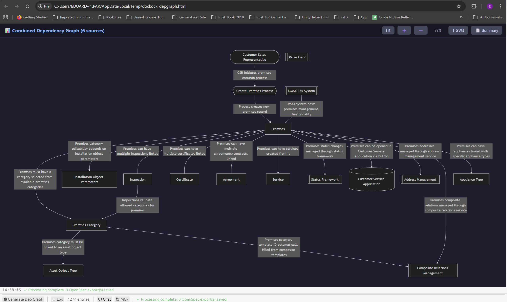

Rendered browser view of the generated Mermaid dependency graph. This visual layer helps the team inspect relationships between business cases, services, entities, and rules more quickly than reading the text summary alone.

What it shows:

- a rendered combined dependency graph across multiple sources
- visual nodes and edges connecting business entities and processes
- browser-based controls for fit, zoom, export, and summary switching
- a graph view suitable for architecture review and implementation planning

Suggested caption:

"Rendered dependency-graph visualization in the browser. This step turns extracted business relationships into an inspectable planning artifact for architecture, coding, and test design."

### Screenshot I. Index-Only Mode Before Indexing

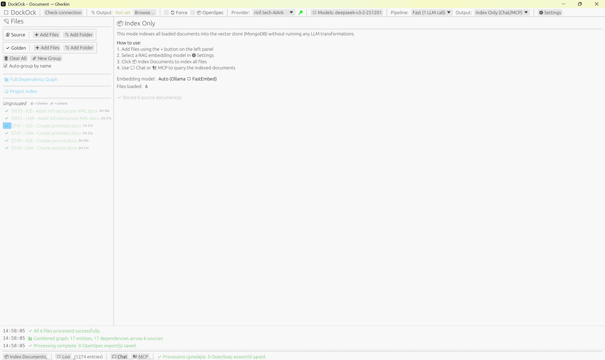

DockOck prepared in IndexOnly mode before the indexing run starts. The document set is loaded, but the goal is persistent retrieval rather than generating a new visible artifact.

What it shows:

- Output mode switched to IndexOnly
- source documents loaded and ready for ingestion
- the UI configured for an indexing run rather than a generation run
- the state just before chunking, embedding, and Mongo persistence begin

Suggested caption:

"Index-only mode prepares the loaded documentation set for semantic indexing and persistent retrieval instead of immediate artifact generation."

### Screenshot J. Indexed Knowledge Queried in the Chat UI

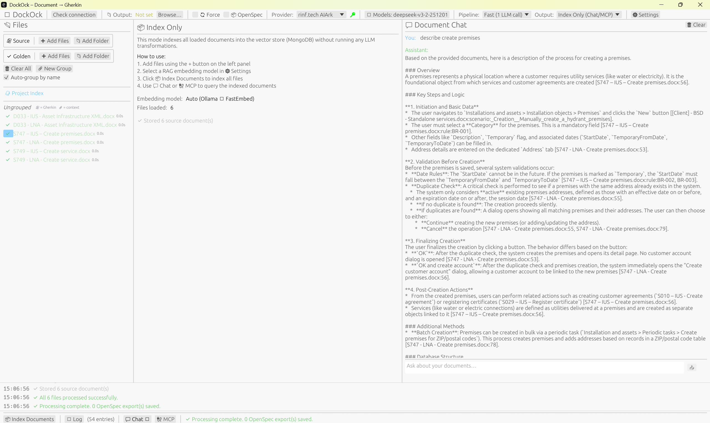

The built-in Chat UI querying the indexed corpus after an index-only run. The response is grounded in semantically retrieved project content stored in Mongo Atlas.

What it shows:

- indexed project knowledge queried through DockOck chat
- semantic retrieval feeding the answer path
- source-backed responses available without rerunning document generation
- the indexed corpus serving as reusable context for coding and analysis questions

Suggested caption:

"After indexing completes, the Chat UI can query the Mongo-backed semantic knowledge base directly, giving coding models grounded answers from the imported documentation set."

### Screenshot K. Indexed Knowledge Queried Through MCP

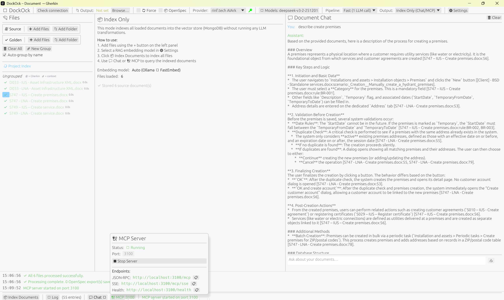

The same index-only knowledge base exposed through the MCP server so external coding agents can query it programmatically.

What it shows:

- MCP-based access to the indexed document corpus
- the same semantic retrieval layer used by the built-in chat experience
- external agent consumption of the Mongo-backed knowledge base
- index-only mode acting as a shared context service for coding workflows

Suggested caption:

"The MCP server exposes the same indexed corpus to external coding agents, so semantic and full-document retrieval are available outside the DockOck UI as well."

## 12. How These Outputs Feed the Delivery Workflow

These documentation-derived outputs are not the end product. They form the specification and planning bootstrap phase that makes later AI coding work more reliable.

The intended downstream chain is:

1. Gherkin features become the canonical executable requirements for Itineris slices.
2. Markdown knowledge-base documents provide durable project and architecture context.
3. Dependency graphs expose structural relationships, coupling, and process dependencies.
4. Index-only mode provides persistent semantic and full-document retrieval for chat and MCP consumers.
5. Itineris-provided validation Gherkins are compared with generated Gherkins so recurring differences can be extracted as correction patterns.
6. Approved features are exported into OpenSpec so feature work is represented as explicit change artifacts rather than ad hoc prompts.
7. OpenSpec commands generate or refine proposal, spec, design, and task artifacts for each feature slice.
8. OpenCode runs the implementation loop against the approved OpenSpec change set using the team's configured provider and model catalog, including the Rinf-backed LLM configuration.
9. Custom agents, prompts, skills, and commands shape how OpenCode executes coding, review, and repair work so the loop stays aligned with team conventions.
10. The autoresearch OpenCode integration is used where appropriate to strengthen the coding loop with targeted research, context gathering, and refinement before or during implementation.
11. Coding agents create production code aligned to the approved artifacts and retrieved source context.
12. Test-generation agents create:
   - unit tests for isolated business logic
   - integration tests for service and persistence boundaries
   - Testcontainers-based environment tests for external dependencies
   - performance tests for throughput, latency, and scale assumptions
   - UI tests for end-to-end user behavior
13. Review agents compare implementation and tests against the originating specifications, indexed source material, dependency relationships, and Itineris validation patterns.

## 13. Itineris Validation, Implementation, and Test Strategy

This chapter makes the Itineris-specific delivery logic explicit. It answers the two questions that are easy to miss in a quick diagonal read: how AI is used for implementation, and how AI is used for the automated tests we generate specifically for Itineris.

### Objective

Turn Itineris source documents and reviewer-authored Gherkin assets into a tighter execution loop where specification generation, implementation, and automated testing reinforce each other.

### End-to-End Itineris Flow

### From Itineris Documents to Corrected Gherkins

For Itineris, the Gherkin step is not a single-pass document conversion.

We generate an initial feature set from the project documents, then compare that generated output against manually written Gherkin files provided by the Itineris team for testing. Those manual scenario files act as the validation source of truth for style, scope, lifecycle placement, scenario structure, and testing intent.

The comparison step is used to:

- detect systematic gaps between generated and approved scenarios
- extract repeated correction patterns instead of fixing each file manually
- improve the final generated Gherkins before they are promoted downstream
- preserve Itineris-specific conventions rather than drifting into generic wording or invented behavior

This is the specific compare-and-improve feedback loop described in the validation-source-of-truth workflow and in the Gherkin quality improvement plan.

### AI-Assisted Implementation for Itineris Features

Once the corrected Gherkins are approved, they become the execution contract for the implementation loop.

The AI-assisted implementation path is:

1. Convert approved Itineris Gherkins into OpenSpec proposal, spec, design, and tasks.
2. Use those artifacts to define a bounded feature slice.
3. Run OpenCode with the right agent stack for the slice type.
4. Generate implementation changes in small reviewable increments instead of one large prompt-driven change.
5. Re-check each slice against the originating Gherkins, Markdown context, dependency graph, and retrieved source documents.

That means AI is not used here as a generic code generator. It is used as a controlled implementation engine whose prompt space is bounded by Itineris documents, approved Gherkins, and explicit change artifacts.

### AI-Assisted Testing for Itineris Features

Testing is also part of the same specification loop, not an afterthought.

For Itineris, the corrected Gherkins are then fed to testing agents in two distinct ways:

1. Independent test-generation agents use the approved scenarios to create automated tests for business behavior without depending on the implementation prompts that produced the code.
2. UI automation agents use the same approved Gherkins to build Playwright end-to-end tests for the user flows described in the Itineris documents.

In other words, the same corrected Gherkin set is the hand-off artifact both for implementation and for downstream automated testing.

In practice, that gives us a layered testing strategy:

- Gherkins define the expected behavior
- code-generation agents implement the feature
- independent test agents generate verification from the same approved behavior contract
- Playwright agents translate user-facing scenarios into browser-level regression tests

### Itineris Test Feedback Loop

### Why This Matters

This Itineris-specific flow gives us three important controls:

- document fidelity, because generated behavior is corrected against real Itineris examples
- implementation discipline, because coding agents work from approved change artifacts rather than a free-form brief
- test independence, because the tests come from approved Gherkins and separate test agents, including Playwright coverage for UI flows

## 14. OpenSpec to OpenCode Delivery Loop

This workflow starts after DockOck has produced and the team has approved the specification package for a feature or change.

### Objective

Turn approved documentation-derived artifacts into controlled implementation changes by using OpenSpec as the change-definition layer and OpenCode as the execution layer.

### Why This Matters

The key constraint in this workflow is that feature implementation should not begin from a loosely phrased coding prompt.

Instead, the team first creates or updates an explicit OpenSpec change set, then uses OpenCode to execute against that change set with the correct provider, models, commands, and agent behaviors.

That creates a stronger loop because:

- the implementation target is explicit and reviewable
- change intent is separated from code synthesis
- custom commands and agents can enforce house style and workflow rules
- research and retrieval can happen as first-class steps instead of being improvised inside a single prompt

### Inputs to This Workflow

The downstream loop is expected to consume some or all of the following:

- approved Gherkin features
- approved Markdown knowledge-base outputs
- dependency graph outputs where structural context matters
- indexed source and generated artifacts available through chat or MCP retrieval
- retained project documentation kept inside the repository so agents can search the original source files directly as a fallback during an OpenSpec change
- the project's chosen tech-stack profile

### Context Access Pattern

During an OpenSpec change, agents should prefer indexed retrieval through chat or MCP when that source is sufficient.

The original project documents are also retained in the repository so agents can search those files directly as a fallback when indexed retrieval is incomplete, when an exact file is required, or when the change needs side-by-side access to generated artifacts and raw source documents.

### Tooling Roles

| Tool | Role in the loop |
|---|---|
| DockOck | Produces the approved specification and retrieval artifacts |
| OpenSpec | Defines the change through proposal, spec, design, and task artifacts |
| OpenCode | Executes the implementation loop against the approved change set |
| Custom provider config | Routes OpenCode to the team's provider and Rinf-backed LLM models |
| autoresearch-opencode | Improves the coding loop with targeted research and context acquisition |
| Custom agents and commands | Standardize how prompts, skills, review steps, and edit loops are run |

### Current Custom Agent and Command Catalog

The current custom workflow layer includes a broad agent catalog plus a maintenance command that improves the catalog over time.

#### Planning and Product Framing Agents

- `business-analyst`: gathers and documents detailed software requirements and acceptance criteria
- `pm-coordinator`: coordinates the overall software delivery lifecycle
- `principal-technical-expert`: breaks product requirements into implementable technical tasks
- `product-engineer`: bridges product requirements with technical implementation decisions
- `project-preferences-advisor`: enforces and evolves permanent project-wide development preferences

#### Architecture and Design Agents

- `software-architect`: designs robust and scalable software architecture for the target stack
- `architecture-advisor`: provides architecture guidance grounded in Clean Architecture and Righting Software principles
- `ddia-advisor`: advises on data-system design using the patterns from Designing Data-Intensive Applications
- `api-designer`: focuses on REST and GraphQL API design quality and developer experience
- `database-architect`: owns PostgreSQL schema design, query optimization, and performance considerations
- `ui-ux-designer`: defines design-system, accessibility, and user-experience direction

#### Implementation and Platform Agents

- `backend-developer`: implements backend features in C# and .NET using clean architecture practices
- `frontend-developer`: implements React and TypeScript frontend work on the team's selected stack
- `build-engineer`: handles build systems, compilation diagnostics, and build automation
- `devops-engineer`: handles CI/CD, infrastructure as code, and deployment automation
- `kubernetes-expert`: covers production Kubernetes deployment, security, and scalability concerns
- `kafka-expert`: supports event-driven architecture and Kafka-based streaming design
- `redis-expert`: supports caching strategies and in-memory data-structure usage

#### Review, Quality, and Reliability Agents

- `backend-code-reviewer`: reviews backend code for security, performance, and quality risks
- `frontend-code-reviewer`: reviews frontend code for stack compliance, correctness, and maintainability
- `qa-engineer`: drives broad testing coverage, including functional, accessibility, and security concerns
- `test-automation-engineer`: focuses on end-to-end automation with tools such as Playwright and Selenium
- `performance-engineer`: handles profiling, load testing, and SLA-oriented optimization
- `security-engineer`: enforces OWASP-aligned security practices and vulnerability reduction
- `sre-engineer`: focuses on uptime, operational reliability, and incident response readiness
- `documentation-expert`: produces internal and external technical documentation

#### Custom Command

- `improve-agents`: a meta-command that reviews accumulated learnings, identifies which findings should be promoted into agent prompts, proposes targeted prompt updates, and flags stale or duplicate learnings for cleanup rather than auto-applying changes

### Agent File Reference by Workflow Phase

The following table keeps the exact filenames visible so operators can choose the right agent for a given phase without translating from shorthand names.

| File | Primary delivery stage | Use when |
|---|---|---|
| `business-analyst.md` | OpenSpec planning | requirements need to be clarified, normalized, or rewritten into acceptance-oriented language |
| `pm-coordinator.md` | OpenSpec planning | the feature needs task sequencing, delivery coordination, or cross-role orchestration |
| `principal-technical-expert.md` | OpenSpec planning | business scope must be decomposed into concrete technical tasks |
| `product-engineer.md` | OpenSpec planning, OpenCode implementation | product intent needs to stay connected to implementation choices |
| `project-preferences-advisor.md` | planning, implementation, review, repair | the run must follow stable project conventions and team preferences |
| `software-architect.md` | OpenSpec planning | the change needs service boundaries, component structure, or integration design |
| `architecture-advisor.md` | OpenSpec planning, review | the architecture should be validated against explicit design principles |
| `ddia-advisor.md` | OpenSpec planning, review | the feature touches storage, distribution, replication, partitioning, or event/data flow decisions |
| `api-designer.md` | OpenSpec planning, review | the feature introduces or changes API contracts, resource models, or integration surfaces |
| `database-architect.md` | OpenSpec planning, OpenCode implementation, review | the change affects schema design, queries, migrations, or database performance |
| `ui-ux-designer.md` | OpenSpec planning, OpenCode implementation | the feature requires interaction design, accessibility direction, or design-system decisions |
| `backend-developer.md` | OpenCode implementation | backend feature work should be executed in the application and data layers |
| `frontend-developer.md` | OpenCode implementation | frontend feature work should be executed in the React and TypeScript stack |
| `build-engineer.md` | OpenCode implementation, repair | build pipelines, compilation problems, or automation work are blocking delivery |
| `devops-engineer.md` | OpenCode implementation, repair | deployment automation, CI/CD, or environment configuration must be changed |
| `kubernetes-expert.md` | OpenCode implementation, repair | the feature or fix affects Kubernetes manifests, runtime topology, or cluster behavior |
| `kafka-expert.md` | OpenSpec planning, OpenCode implementation, repair | the feature depends on event-driven patterns, topics, consumers, or streaming semantics |
| `redis-expert.md` | OpenSpec planning, OpenCode implementation, repair | caching, eviction, pub/sub, or in-memory data-structure choices matter |
| `backend-code-reviewer.md` | review | backend code needs security, performance, and maintainability review |
| `frontend-code-reviewer.md` | review | frontend code needs stack-compliance, correctness, and maintainability review |
| `qa-engineer.md` | review, repair | functional, accessibility, or broader quality checks need to be defined or expanded |
| `test-automation-engineer.md` | review, repair | end-to-end or automated regression coverage must be added or stabilized |
| `performance-engineer.md` | review, repair | the change has performance risk, profiling work, or SLA implications |
| `security-engineer.md` | review, repair | the change introduces security-sensitive behavior or needs OWASP-oriented review |
| `sre-engineer.md` | review, repair | reliability, observability, incident readiness, or runtime resilience must be improved |
| `documentation-expert.md` | review, repair | the change requires developer-facing, operator-facing, or user-facing documentation updates |
| `improve-agents.md` | periodic maintenance | repeated learnings suggest agent prompts should be tightened or cleaned up rather than rediscovered again |

### Delivery Stage Selection Matrix

This matrix maps the main delivery stages in the OpenSpec-to-OpenCode loop to the most appropriate agent choices.

| Stage | Primary goal | Default agents | Specialist agents to add when needed | Command guidance |
|---|---|---|---|---|
| OpenSpec planning | turn approved feature artifacts into change scope, architecture, and executable tasks | `business-analyst.md`, `principal-technical-expert.md`, `software-architect.md` | `api-designer.md`, `database-architect.md`, `ddia-advisor.md`, `ui-ux-designer.md`, `pm-coordinator.md`, `product-engineer.md` | use your normal OpenSpec commands to generate or refine proposal, spec, design, and tasks; `improve-agents.md` is not a primary planning command |
| OpenCode implementation | execute bounded code changes against the approved OpenSpec change | `backend-developer.md` or `frontend-developer.md`, plus `project-preferences-advisor.md` | `build-engineer.md`, `devops-engineer.md`, `kubernetes-expert.md`, `kafka-expert.md`, `redis-expert.md`, `database-architect.md`, `product-engineer.md` | use the team's normal OpenCode implementation commands and custom prompts; keep `improve-agents.md` out of the hot path |
| Review | validate correctness, design fit, risk, and test adequacy before accepting the slice | `backend-code-reviewer.md` or `frontend-code-reviewer.md`, `qa-engineer.md` | `security-engineer.md`, `performance-engineer.md`, `sre-engineer.md`, `architecture-advisor.md`, `documentation-expert.md`, `test-automation-engineer.md` | run the review and validation commands that correspond to the slice; if the same review issues recur across runs, queue `improve-agents.md` afterward |
| Repair | fix defects, close validation gaps, and stabilize the change after review findings or test failures | the original implementation agent, plus `qa-engineer.md` | `build-engineer.md`, `devops-engineer.md`, `kubernetes-expert.md`, `security-engineer.md`, `performance-engineer.md`, `sre-engineer.md`, `test-automation-engineer.md`, `documentation-expert.md` | use repair and retest commands first; use `improve-agents.md` only when the root cause appears to be an agent-instruction gap rather than a one-off defect |

### Command Selection Note

The current command archive contributes one explicit maintenance command, `improve-agents.md`.

The operational feature loop is therefore still driven primarily by OpenSpec commands, OpenCode commands, and the agent catalog, while `improve-agents.md` acts as a prompt-governance command that should run periodically or after repeated workflow failures rather than during every feature slice.

### Agent Combination Runbook

The matrix above identifies suitable candidates for each delivery stage. This runbook extends that guidance by defining which combinations should be treated as primary, which are optional, and which should usually not be combined in the same pass.

#### OpenSpec Planning Runbook

- Primary combination: `business-analyst.md` + `principal-technical-expert.md` + `software-architect.md`
- Optional additions: `api-designer.md`, `database-architect.md`, `ddia-advisor.md`, `ui-ux-designer.md`, `pm-coordinator.md`, `product-engineer.md`, `project-preferences-advisor.md`
- Avoid in the same pass: `backend-developer.md`, `frontend-developer.md`, `backend-code-reviewer.md`, `frontend-code-reviewer.md`

Reasoning:

- planning runs should sharpen scope, structure, and task boundaries before code generation starts
- implementation agents tend to collapse planning into premature coding decisions
- review agents are more effective after code or executable tasks exist

#### OpenCode Implementation Runbook

- Primary combination for backend slices: `backend-developer.md` + `project-preferences-advisor.md`
- Primary combination for frontend slices: `frontend-developer.md` + `project-preferences-advisor.md`
- Optional additions: `database-architect.md`, `build-engineer.md`, `devops-engineer.md`, `kubernetes-expert.md`, `kafka-expert.md`, `redis-expert.md`, `product-engineer.md`, `ui-ux-designer.md`
- Avoid in the same pass: `backend-developer.md` + `frontend-developer.md` as co-equal primary executors on the same narrow slice, `backend-code-reviewer.md`, `frontend-code-reviewer.md`

Reasoning:

- the implementation pass should have one clear code-owning agent
- cross-stack specialist agents can support the slice, but two primary implementation agents usually blur responsibility
- review agents should not be mixed into the main generation pass unless the workflow explicitly performs micro-review after each edit

#### Review Runbook

- Primary combination for backend slices: `backend-code-reviewer.md` + `qa-engineer.md`
- Primary combination for frontend slices: `frontend-code-reviewer.md` + `qa-engineer.md`
- Optional additions: `security-engineer.md`, `performance-engineer.md`, `sre-engineer.md`, `architecture-advisor.md`, `documentation-expert.md`, `test-automation-engineer.md`, `project-preferences-advisor.md`
- Avoid in the same pass: `backend-developer.md`, `frontend-developer.md` as primary actors, `pm-coordinator.md`

Reasoning:

- review should identify risks and gaps, not reopen full implementation loops immediately
- specialist review agents should be added only when the slice presents matching risk signals
- coordination roles add limited value in a focused technical review pass

#### Repair Runbook

- Primary combination: original implementation agent + `qa-engineer.md`
- Optional additions: `build-engineer.md`, `devops-engineer.md`, `kubernetes-expert.md`, `security-engineer.md`, `performance-engineer.md`, `sre-engineer.md`, `test-automation-engineer.md`, `documentation-expert.md`, `project-preferences-advisor.md`
- Avoid in the same pass: both code reviewers as co-primary actors, broad planning agents such as `business-analyst.md` or `pm-coordinator.md` unless the failure exposed a real scope defect

Reasoning:

- repair should stay anchored to the agent that owns the code change
- quality and specialist agents can narrow the defect quickly when the failure mode is known
- broad planning roles should only come back in when the issue is actually a requirement or task-definition problem

#### Maintenance Runbook

- Primary combination: `improve-agents.md`
- Optional additions: `project-preferences-advisor.md`, `documentation-expert.md`
- Avoid in the same pass: implementation or review agents unless the goal is to inspect a specific recurring workflow failure

Reasoning:

- maintenance runs should improve prompts and learnings, not expand into feature delivery work
- this command is most useful after patterns have repeated across multiple slices

### Example Feature Flows

Use these examples when the matrix and runbook are still too abstract for the current feature slice.

#### Example A. Backend Feature Slice

Scenario: an approved feature requires a new backend endpoint, validation rules, persistence changes, and tests.

Recommended flow:

1. OpenSpec planning: `business-analyst.md` + `principal-technical-expert.md` + `software-architect.md`
2. Add `api-designer.md` if the endpoint contract is new or externally consumed.
3. Add `database-architect.md` if the feature needs schema updates, indexes, or non-trivial queries.
4. Generate or refine the OpenSpec proposal, spec, design, and tasks.
5. OpenCode implementation: `backend-developer.md` + `project-preferences-advisor.md`
6. Add `database-architect.md` during implementation if migrations or query tuning are part of the slice.
7. Add `build-engineer.md` only if the slice is blocked by compilation, package, or build automation issues.
8. Run the normal implementation command set and, if needed, the autoresearch loop for repository discovery or library checks.
9. Review: `backend-code-reviewer.md` + `qa-engineer.md`
10. Add `security-engineer.md` for auth, secrets, sensitive data, or exposed attack-surface changes.
11. Add `performance-engineer.md` if the endpoint is latency-sensitive or high-volume.
12. Repair: return to `backend-developer.md` + `qa-engineer.md` until the slice is clean.

Why this flow works:

- it keeps architecture and contract decisions ahead of code generation
- it assigns one clear implementation owner for the slice
- it adds specialist review only when the feature risk profile warrants it

#### Example B. Frontend Feature Slice

Scenario: an approved feature requires a new UI flow, form validation, route updates, and API integration.

Recommended flow:

1. OpenSpec planning: `business-analyst.md` + `principal-technical-expert.md` + `software-architect.md`
2. Add `ui-ux-designer.md` if the slice changes user flow, accessibility, or design-system usage.
3. Add `api-designer.md` if the frontend needs new request or response shapes.
4. Generate or refine the OpenSpec proposal, spec, design, and tasks.
5. OpenCode implementation: `frontend-developer.md` + `project-preferences-advisor.md`
6. Add `ui-ux-designer.md` during implementation if the interaction model is still being clarified.
7. Add `product-engineer.md` if the UI behavior needs tight alignment with product intent across edge cases.
8. Run the normal implementation command set and invoke autoresearch when existing UI patterns or library usage need to be discovered first.
9. Review: `frontend-code-reviewer.md` + `qa-engineer.md`
10. Add `test-automation-engineer.md` if the slice needs end-to-end coverage or regression automation.
11. Add `security-engineer.md` when the flow changes auth, token handling, or protected-route behavior.
12. Repair: return to `frontend-developer.md` + `qa-engineer.md` until the slice is stable.

Why this flow works:

- it separates user-flow design from UI code execution
- it keeps the frontend implementation anchored to one primary code-owning agent
- it brings in automation and security review only when the feature surface requires them

#### Example C. Infrastructure and Platform Slice

Scenario: an approved feature requires infrastructure changes such as Kafka topic integration, Redis-backed caching, deployment updates, or Kubernetes runtime changes.

Recommended flow:

1. OpenSpec planning: `business-analyst.md` + `principal-technical-expert.md` + `software-architect.md`
2. Add `ddia-advisor.md` if the slice changes event flow, data consistency, delivery guarantees, or distributed-system tradeoffs.
3. Add `kafka-expert.md` for topic design, producer-consumer behavior, ordering, retries, or dead-letter handling.
4. Add `redis-expert.md` if the slice introduces caching, invalidation rules, pub/sub, or in-memory coordination patterns.
5. Add `database-architect.md` if the infrastructure change also affects persistence design or query strategy.
6. Generate or refine the OpenSpec proposal, spec, design, and tasks.
7. OpenCode implementation: choose one primary execution owner based on the dominant change surface.
8. Use `backend-developer.md` if the main work is application-side integration code.
9. Use `devops-engineer.md` if the main work is delivery pipeline, environment, or deployment automation.
10. Add `kubernetes-expert.md` when manifests, scaling behavior, runtime topology, or cluster concerns are part of the slice.
11. Add `build-engineer.md` if packaging, compilation, or release automation blocks the slice.
12. Review: `qa-engineer.md` plus the most relevant specialist reviewer for the risk surface.
13. Add `security-engineer.md` for secrets, network exposure, credentials, or trust-boundary changes.
14. Add `sre-engineer.md` for resilience, observability, rollback readiness, or incident-risk review.
15. Add `performance-engineer.md` when throughput, latency, fan-out, or infrastructure load characteristics matter.
16. Repair: return to the original implementation owner plus `qa-engineer.md` until the slice is stable.

Why this flow works:

- it keeps distributed-system and platform tradeoffs visible before implementation starts
- it avoids splitting ownership across too many infrastructure specialists at once
- it ties review depth to the real operational risk of the slice

### Decision Trees

Use these decision trees for rapid operator guidance.

#### Decision Tree A. Choose the Planning Stack

1. Start with `business-analyst.md` + `principal-technical-expert.md` + `software-architect.md`.
2. If the slice changes APIs, add `api-designer.md`.
3. If the slice changes schema, persistence, or queries, add `database-architect.md`.
4. If the slice changes event flow or distributed data behavior, add `ddia-advisor.md` and possibly `kafka-expert.md`.
5. If the slice changes user flow or interface behavior, add `ui-ux-designer.md`.
6. If sequencing and cross-team coordination are the main problem, add `pm-coordinator.md`.

#### Decision Tree B. Choose the Implementation Owner

1. If the slice is mainly backend code, use `backend-developer.md`.
2. If the slice is mainly frontend code, use `frontend-developer.md`.
3. If the slice is mainly CI/CD or deployment automation, use `devops-engineer.md`.
4. If the slice is mainly build, packaging, or compilation work, use `build-engineer.md`.
5. If the slice is mainly Kubernetes runtime behavior, add `kubernetes-expert.md` and keep one primary owner.
6. Always add `project-preferences-advisor.md` when you need the implementation run to stay aligned with project conventions.

#### Decision Tree C. Choose the Review Stack

1. Backend slice: start with `backend-code-reviewer.md` + `qa-engineer.md`.
2. Frontend slice: start with `frontend-code-reviewer.md` + `qa-engineer.md`.
3. Security-sensitive slice: add `security-engineer.md`.
4. Latency-sensitive or high-volume slice: add `performance-engineer.md`.
5. Infrastructure or runtime-reliability slice: add `sre-engineer.md`.
6. If end-to-end automation is missing, add `test-automation-engineer.md`.
7. If docs are part of the acceptance bar, add `documentation-expert.md`.

#### Decision Tree D. Choose Repair vs Maintenance

1. If the failure is specific to one feature slice, return to the original implementation owner plus `qa-engineer.md`.
2. If the failure is build or deployment related, add `build-engineer.md`, `devops-engineer.md`, or `kubernetes-expert.md` as needed.
3. If the same mistakes repeat across multiple slices, run `improve-agents.md` after the feature repair loop.
4. If the problem is actually ambiguous scope rather than defective execution, return to the planning stack instead of staying in repair mode.

### Quick Routing Cheat Sheet

Use this section when a routing decision is needed without consulting the full reference material.

| Situation | Start here | Add these if needed | Do not start with |
|---|---|---|---|
| new backend feature | `backend-developer.md` + `project-preferences-advisor.md` | `api-designer.md`, `database-architect.md`, `security-engineer.md`, `performance-engineer.md` | `backend-code-reviewer.md` |
| new frontend feature | `frontend-developer.md` + `project-preferences-advisor.md` | `ui-ux-designer.md`, `api-designer.md`, `test-automation-engineer.md`, `security-engineer.md` | `frontend-code-reviewer.md` |
| infrastructure-heavy change | dominant owner plus `project-preferences-advisor.md` | `devops-engineer.md`, `kubernetes-expert.md`, `kafka-expert.md`, `redis-expert.md`, `sre-engineer.md` | both frontend and backend developers as co-primary owners |
| API or schema ambiguity | `business-analyst.md` + `principal-technical-expert.md` + `software-architect.md` | `api-designer.md`, `database-architect.md`, `ddia-advisor.md` | implementation agents |
| review and sign-off | code reviewer + `qa-engineer.md` | `security-engineer.md`, `performance-engineer.md`, `documentation-expert.md`, `test-automation-engineer.md` | planning agents |
| repeated workflow mistakes | `improve-agents.md` | `project-preferences-advisor.md`, `documentation-expert.md` | implementation agents in the same run |

### Slice Dominance Glossary

The examples and decision trees assume that every feature slice has a dominant change surface. This section extends the Terminology Standard with the shorthand used for slice classification.

- Backend-dominant slice: most of the work is in API handlers, services, validation, repositories, persistence, or domain logic.
- Frontend-dominant slice: most of the work is in UI flows, forms, routes, client-side state, view composition, or browser behavior.
- Infrastructure-dominant slice: most of the work is in deployment automation, runtime configuration, messaging, caching, observability, scaling, or platform behavior.
- Mixed slice: multiple change surfaces move together, but one still causes most of the technical risk or most of the implementation effort.
- Planning defect: the current blocker is missing scope clarity, missing acceptance criteria, or unclear technical boundaries rather than bad code.
- Repair defect: the scope is already acceptable, but implementation, test, build, deployment, or runtime behavior is failing.

Rule of thumb:

- choose the primary implementation owner based on the dominant slice type
- choose specialist agents based on the main risk, not on every touched file
- move back to planning only when the blocker is a planning defect rather than a repair defect

### Visual Routing Diagram

This diagram provides a compact visual path from slice type to the default execution stack.

Open the interactive routing view here: [AI_AGENT_ROUTING_VISUALS.html](AI_AGENT_ROUTING_VISUALS.html)

### Visual Delivery Loop Diagram

This diagram shows the relationship between planning, implementation, review, repair, and prompt-maintenance work.

Open the interactive delivery-loop view here: [AI_DELIVERY_LOOP_VISUALS.html](AI_DELIVERY_LOOP_VISUALS.html)

### Operator Workflow

1. Generate and review Gherkin, Markdown, graph, or index artifacts in DockOck.
2. Approve the feature slice that should move into implementation.
3. Export or translate the approved feature into an OpenSpec change.
4. Run OpenSpec commands to generate or update the proposal, spec, design, and tasks for that change.
5. Review the OpenSpec artifacts and confirm the scope is implementation-ready.
6. Open the target repository in OpenCode with the relevant change context.
7. Execute the team's custom commands or agents so OpenCode works from the approved OpenSpec artifacts rather than a free-form prompt.
8. Use the configured provider and model selection that points at the team's Rinf-backed LLM environment.
9. Invoke autoresearch integration when the task requires deeper codebase discovery, dependency lookup, external library comparison, or design validation.
10. Let OpenCode generate or refine code changes in bounded slices.
11. Run the review, repair, and test commands defined by the team workflow.
12. Repeat until the change satisfies the OpenSpec intent, tests, and review gates.

### What the System Does Internally

#### Step 1. Treat OpenSpec as the source of change intent

Once a feature is approved, OpenSpec becomes the operational source of truth for the implementation loop.

That means implementation work is driven from structured change artifacts rather than from a single ephemeral coding prompt.

#### Step 2. Bind OpenCode to the team's provider and models

OpenCode is configured to use the team's own provider integration and model catalog.

In this repository that pattern is represented by an OpenCode-compatible provider configuration, which allows the coding loop to target the team's managed LLM endpoints instead of assuming a public default provider.

#### Step 3. Apply custom agents, prompts, skills, and commands

The team uses its own workflow layer on top of OpenCode.

That workflow layer can determine:

- how feature context is loaded
- which prompts or skills are applied for planning, coding, review, or repair
- which commands are used for slice generation, test generation, validation, and cleanup
- how much autonomy an agent run should have before handing control back to a reviewer

#### Step 4. Use autoresearch to improve the coding loop

Not every coding step should immediately produce edits.

For ambiguous or high-risk work, autoresearch is used to improve the loop by collecting better context first, such as:

- relevant files and modules
- existing patterns in the repository
- framework or library usage examples
- external implementation guidance when that is allowed and useful

This reduces unnecessary generations and helps the coding agent converge on repository-aligned changes more quickly.

#### Step 5. Execute in bounded slices

The implementation loop should operate on bounded feature slices that map back to OpenSpec tasks.

That makes it easier to:

- review code diffs
- validate tests incrementally
- isolate regressions
- rerun only the necessary research or repair steps

### Quality Gates for the Delivery Loop

Before a change is considered complete, it should satisfy the following checks:

1. The code change maps back to an approved OpenSpec change and task set.
2. The implementation remains consistent with the approved Gherkin behavior and supporting Markdown or graph context.
3. Retrieval-backed source material can still explain why the change exists and what requirement it satisfies.
4. Custom command and agent steps have been run for the required planning, coding, and review phases.
5. autoresearch was used where the task needed additional discovery or external confirmation.
6. The resulting code and tests pass the repository's validation gates.
7. Human review can follow the trace from documentation to specification to implementation.

